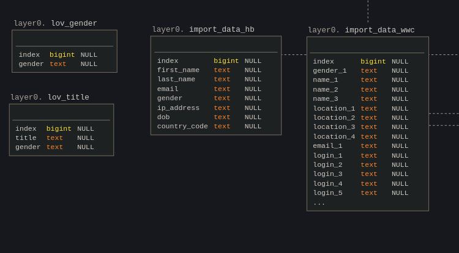
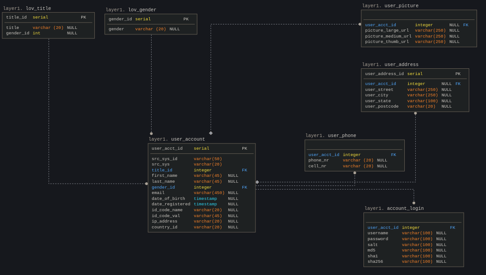
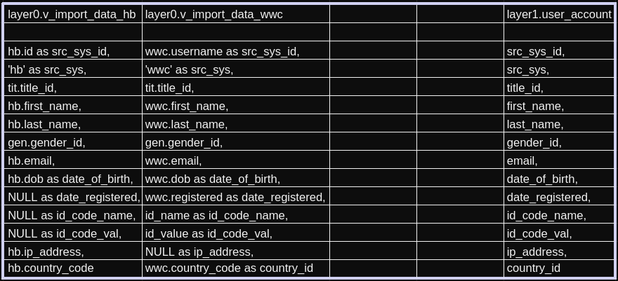
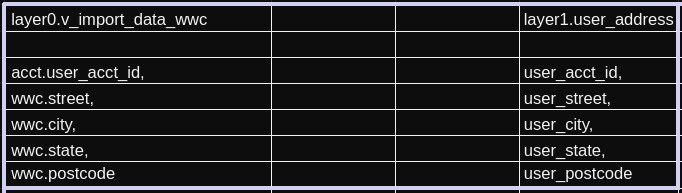

# music data warehouse

Data pipeline and datawarehouse for music games.

The aim of this project is to create a small Datawarehouse, populated with data about users of two games. The data comes from two systems and analysis will be done on both systems at once.

The solution is based on Python with a database running on PostgreSQL. Database has two layers (schemas), one for import of data files and one with transformed data available for analysis. It is possible to load data from this layer to end-user systems for analysis. It is also possible to do analysis in SQL and build a datamart level on top of the data directly in the database.

Virtual environments for both systems are created using Docker and are managed by Docker-compose.

### **Main files:**
#### **Python files:**
- `musicdwh/musicdwh.py`

Python script opening extract files from a given date. Games have two sources, "hb" in .csv and "wwc" in .json. They come in once a day and are exported into folder structure based on date.
- `hb` data contain IP address, but miss country code. To obtain country code we utilize ipapi, which unfortunately in the free tier has limits of queries. Therefore the data is passed in chunks and there is waiting time between chunks.
This makes the code run slowly. There are other IP converters available, all have limits in free tier. Paid tier would be without these limitations.
- `wwc` data comes in .json format, one cell can contain lists of different values. The lists are parsed into new columns of dataframe upon load.
- two lists of values (LOVs) have been added to the load to enable saving repetitive data in separate tables.
- data in the database is updated with new values, at the moment there is no historization feature. This can be added in the future.

#### **SQL scripts working with the data:**
- `sql_scripts/startup_sql_scripts` : scripts setting up the database, tables and views
- `sql_scripts/04_L0_L1_load.sql` : ETL script processing data from layer0 to layer1, creating dependencies
- `sql_scripts/05_L0_L1_update.sql` : ETL script updating any changes in existing records

#### **Reports on the data**
- `questions.sql`
    - report on gender composition of the users
    - report on youngest and oldest user per country
    - answers to task questions

## Database diagram and mappings
### **Layer0**
Import layer for data, raw data is inserted into cleared tables.
Raw data is then accessed using views, in which some columns are transformed (`v_import_data_hb`, `v_import_data_wwc`).


### **Layer1**
Layer for processed data. 

LOVs (lists of values) are imported from Layer0 and their IDs are used in the main data tables. 
- `lov_title` - list of values of title
- `lov_gender` - list of values of gender

Sources `hb` and `wwc` are united into table `user_account` and detailed information from source `wwc` is stored in tables: 
- `account_login` - login details 
- `user_address` - address details 
- `user_phone` - user telephone numbers (this table can be simplified in the future to contain phone number and indicator of type)
-  `user_picture` - photos of user accounts (this table can be simplified in the future to contain picture reference and indicator of type)



### **Logical mapping of data**
Data from both source systems is mapped into Layer1 main user table `layer1.user_account`

ID values for gender and title are taken from LOV tables via foreign keys.

Detailed information from `wwc` source is mapped into detail tables, e.g. users' addresses into table `layer1.user_address`




--------

## Issues / TODO
- long run time due to lookup of IP addresses via API due to free tier restrictions
- more tests need to be added
- improve security, no plaintext secrets
- create indexes on tables in `layer1`

## Features
--------

* create a database schema
* clean data
* create data pipeline (ETL)
* import user accounts
* update any modified records
* generate reports in SQL

## Prerequisites
--------
* install docker
* install docker-compose
* install git
* clone repository:
```
git clone https://github.com/dagmar-urbancova/musicdwh
```


## Getting Started
* start service:
```
docker-compose up --build
```

To run  `another day's data` , modify env var DATA_DATE to different date, e.g.:
```
export DATA_DATE='2021-04-29'
```

making sure the folder structure contains this date

and run the Python script
```
python musicdwh/musicdwh.py
```

### **In case of issues with running from Docker-compose:**
* set env var (set by docker containers automatically)

```
export DATA_DATE='2021-04-28'
```

In case Python does not connect to the database, run .py manually.
```
python musicdwh/musicdwh.py
```

## Credits
-------
Docker-related advice from Vitek at https://github.com/squeaky-godzilla

-------
## License
* Free software: MIT license
